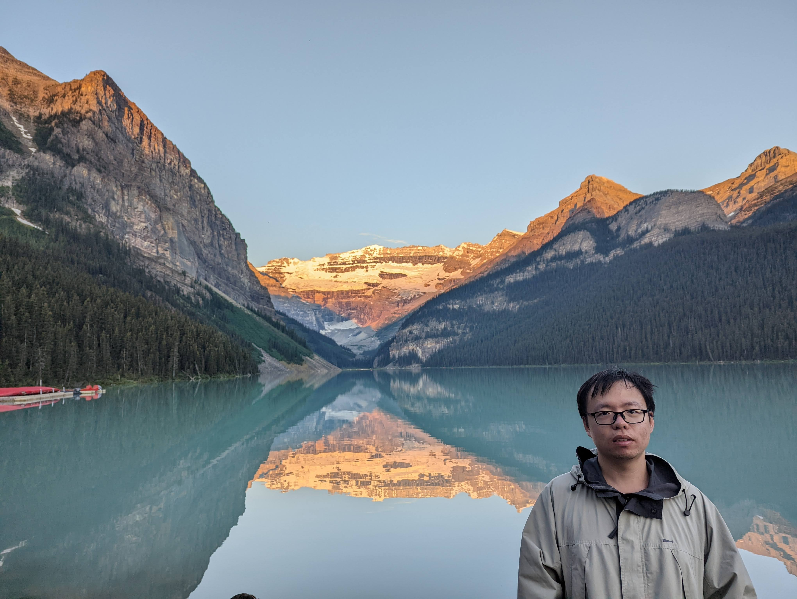

    

        

        

            <a href="mailto:czeng1@ufl.edu">
            <i class="fas fa-envelope"></i> czeng1@ufl.edu
            </a> 
            <a href="https://github.com/zeng-cheng" target="_blank">
            <i class="fab fa-github"></i> zeng-cheng
            </a>
        

    

  
    

        <h1>Cheng Zeng</h1>
        

            Welcome! I’m a Ph.D. candidate in the Department of Statistics at the University of Florida, graduating in Summer 2025. I’m fortunate to be advised by [Dr. Leo Duan](https://leoduan.github.io/). Before joining UF, I earned my bachelor's degree in Mathematics from the University of Science and Technology of China. My research interests broadly center around Bayesian nonparametrics, semiparametric methods, optimization-driven Bayesian inference, and deep generative models.
        

        

        You can find my [Research](/research) and [CV](cv/CV-ZengCheng.pdf) here.
        

    

